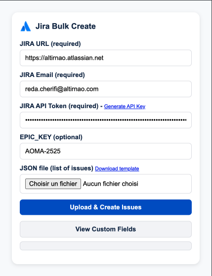

# 🧩 Jira Issue Creator (Chrome Extension)

A Chrome extension that lets you **create Jira issues** directly from your browser using a **JSON file upload**.  
It also allows you to **list all custom Jira fields** from your workspace.

---

## 🚀 Features

- 🔐 Securely connect to your Jira Cloud instance
- 📁 Upload a JSON file containing multiple tickets to create
- 🧾 Automatically links issues to an optional **Epic key**
- 🧩 Retrieve and display **custom Jira fields** in real-time
- 🧠 Remembers your Jira URL for convenience

---

## 🖥️ Popup Interface

The extension popup provides the following fields:

| Field | Description | Required |
|-------|--------------|-----------|
| **JIRA URL** | Your Jira Cloud URL (e.g., `https://altirnao.atlassian.net/`) | ✅ |
| **JIRA Email** | Your Jira account email | ✅ |
| **JIRA Token** | A personal access token (PAT) for authentication | ✅ |
| **EPIC Key** | The Epic issue key (e.g., `AOMA-2525`) | ❌ |

---

## 📤 Upload JSON

Click **“Import JSON”** to select a file structured like this:

```json
[
  {
    "summary": "Add new feature to dashboard",
    "description": "Implement new graph widget for KPIs"
  },
  {
    "summary": "Fix login redirect",
    "description": "Resolve OAuth redirection issue when returning from SSO"
  }
]
```

After importing, click **“Create JIRA Issue”** to automatically create issues in your project.

---

## 🔍 List Jira Fields

Below the main form, a **“JIRA Fields”** section displays all available fields fetched from your Jira instance using the REST API.

Example output:

```json
[
  "Attachments",
  "Sub-task",
  "Assignee",
  "Reporter",
  "Priority",
  "Labels",
  "Epic Link",
  "Summary",
  "Description"
]
```

---

## 🧱 Installation

1. Clone or download this repository
2. Open **Chrome** and go to `chrome://extensions`
3. Enable **Developer mode**
4. Click **“Load unpacked”** and select the project folder
5. The **Jira Issue Creator** icon will appear in your extensions bar

---

## ⚙️ Permissions

This extension uses:

- `storage` — to remember your Jira URL
- `activeTab` — to detect the current tab’s domain
- `fetch` — to call Jira APIs securely

---

## 🧩 Example UI



---

## 📜 License

MIT License © 2025 — Developed for internal productivity by **Altirnao**
